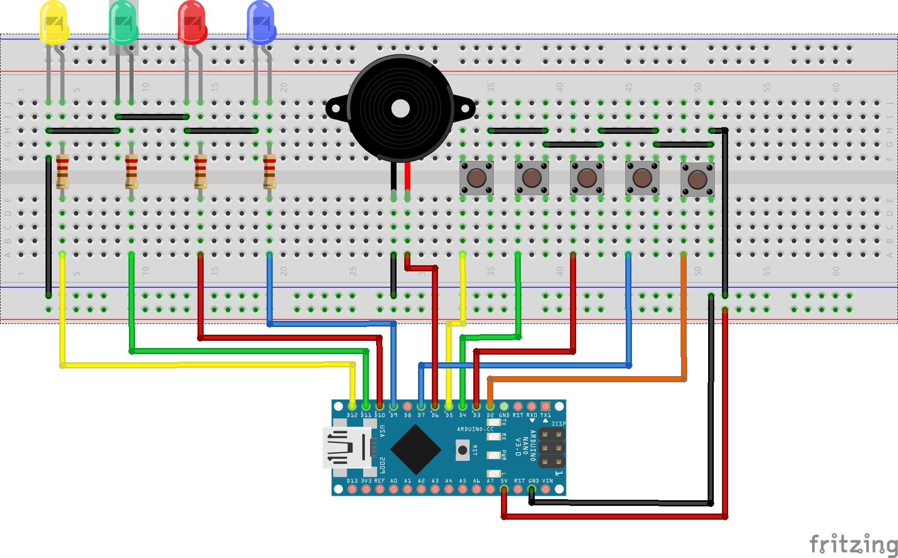

# Simon says memory game for children

## Mode
When the device is started the attraction mode is active. This is a catchy infinite alternating blink pattern. In this mode the user can choose the desired mode
Start the game with selecting the mode. Blue button will take you to the music freestyle mode and any other key will start the regular game.

### Simon Says
The general idea ist that the LEDs will flash after one another in a random order. The user needs to input the pattern through the buttons. If the input was correct the next level is started and the pattern will contain one more step (the rest of the pattern will stay the same) - the game starts with one LED blinking.
If the user makes 13 patterns he is a winner.

### Music freestyle mode
Entering this mode the user can press any button and the correspondig LED blink as well as the corresponding sound will be played.
Pressing the interrupt button will leave this mode starting with the attraction mode.

## Wiring

## TODO
 - display level on a 7 segemnt display, an LCD, or similar
 - Make volume adjustable with poti - probably use a speaker instead of a buzzer
 - add modes (such as battle mode, etc...)
 - keep track of high score and display it (incl. enetring name after finih)
 - add difficulty levels (faster blinks, more levels) --> probably menu setup to adjust settings

## Desclaimer
The code is based on the sketch presented in this sparkfun tutorial : https://learn.sparkfun.com/tutorials/sik-experiment-guide-for-arduino---v32/experiment-16-simon-says
